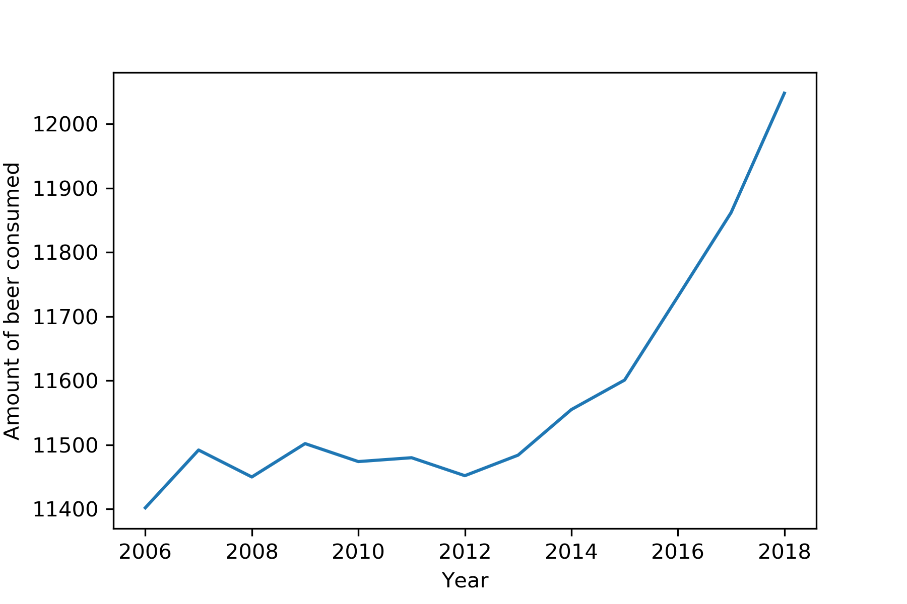

# Tools for Computational Scientists Homework

## Part one
Here are the titles of the articles found with help from [Google Scholar](https://scholar.google.com/):

- Fantastic yeasts and where to find them: the hidden diversity of dimorphic fungal pathogens 
- An analysis of the forces required to drag sheep over various surfaces
- The neurocognitive effects of alcohol on adolescents and college students

## part two

The following plot shows the amount of beer consumed in the Netherlands from 2006 to 2018(DPI=300).

